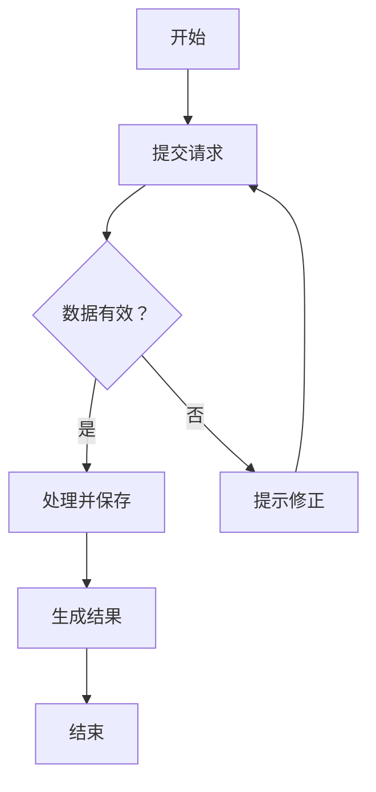
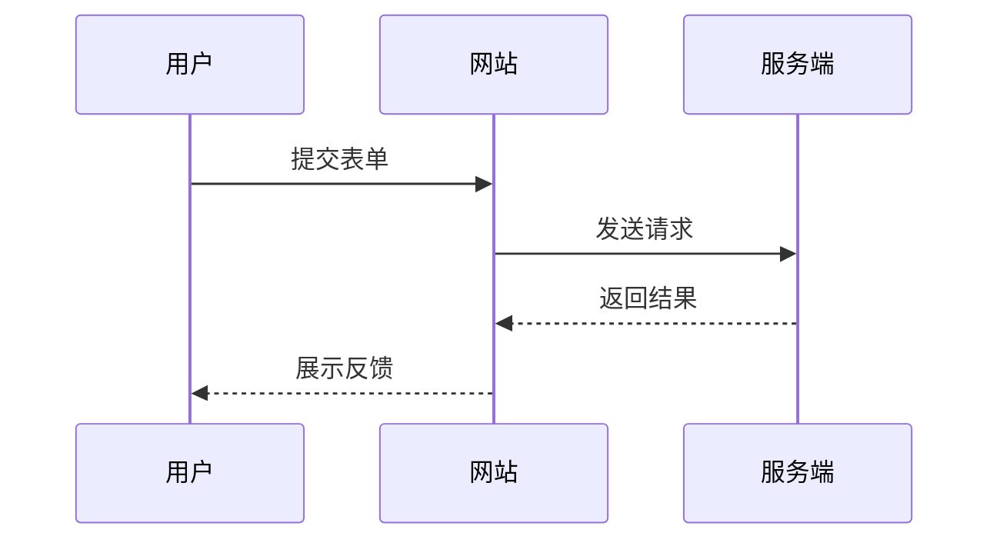

# Markdown 综合功能演示

> 一份用于测试 Markdown 渲染器的示例文档，覆盖常用排版、代码、公式、表格、图表与流程图。

## 1. 文本与排版

这是普通文本，包含 **粗体**、*斜体*、***粗斜体***、~~删除线~~ 与 `行内代码`。

- 无序列表项目 A
  - 二级项目
  - 另一个二级项目
- 无序列表项目 B

1. 有序步骤一
2. 有序步骤二
3. 有序步骤三

链接示例：[Markdown Guide](https://www.markdownguide.org/)。

---

## 2. 引用与任务清单

> 好的文档不仅记录结论，也让读者能快速理解上下文。
>
> —— 示例引用

- [x] 明确测试范围
- [x] 添加基础 Markdown 元素
- [ ] 接入真实业务数据
- [ ] 发布最终版本

## 3. 表格

| 指标 | 一月 | 二月 | 三月 | 环比 |
|:--|--:|--:|--:|--:|
| 访问量 | 12,400 | 14,800 | 18,200 | +23% |
| 注册数 | 620 | 760 | 1,010 | +33% |
| 转化率 | 5.0% | 5.1% | 5.5% | +0.4pp |

## 4. 代码

```python
def greeting(name: str) -> str:
    """返回一条问候语。"""
    return f"你好，{name}！"

print(greeting("Markdown"))  
```

```json
{
  "project": "Markdown Demo",
  "status": "active",
  "features": ["table", "chart", "diagram"]
}
```

## 5. 数学公式

行内公式：$E = mc^2$。

块级公式：

$$
\operatorname{Conversion\ Rate} = \frac{\operatorname{Conversions}}{\operatorname{Visits}} \times 100\%
$$


## 7. 流程图



## 8. 时序图



## 9. 详情折叠区

<details>
<summary>点击展开补充说明</summary>

这里可以放置较长的说明、注意事项或调试信息。

</details>

## 10. 结语

该文件适合用于验证编辑器、文档站点或代码仓库中的 Markdown 渲染效果。
