# Mermaid 图表测试文档


> 用 markdown 查看器打开本文件，验证 ```mermaid 代码块能正常渲染成图。
> 覆盖：流程图、时序图、类图、状态图、甘特图、饼图、旅行图、思维导图、时间线、象限图、需求图。

## 1. 流程图（flowchart TD）

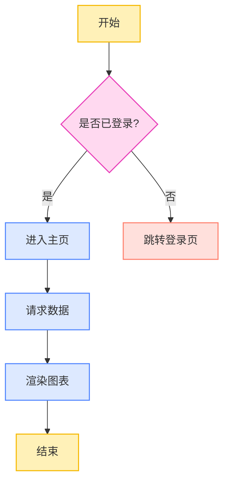

## 2. 流程图（flowchart LR，带子图）

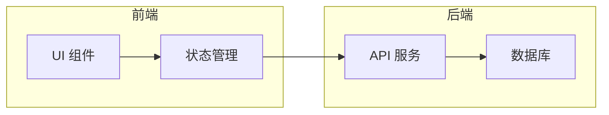

## 3. 时序图（sequenceDiagram）

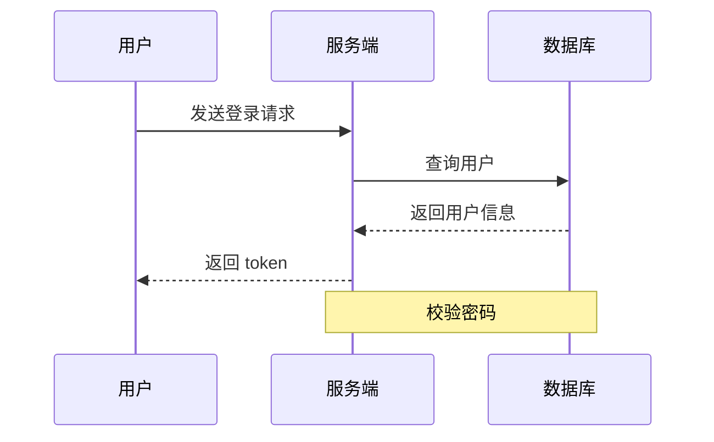

## 4. 类图（classDiagram）

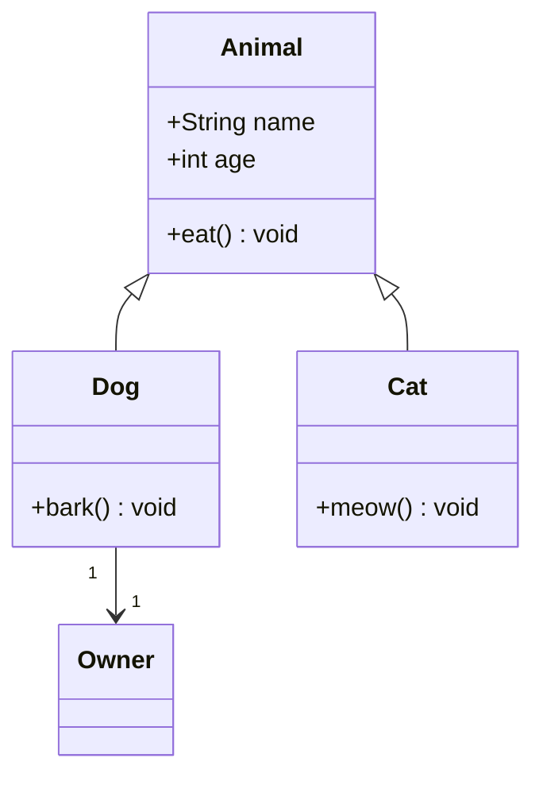

## 5. 状态图（stateDiagram-v2）

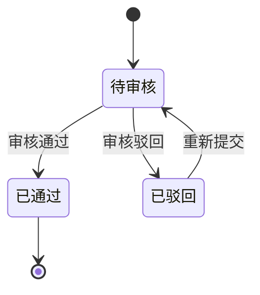

## 6. 甘特图（gantt）

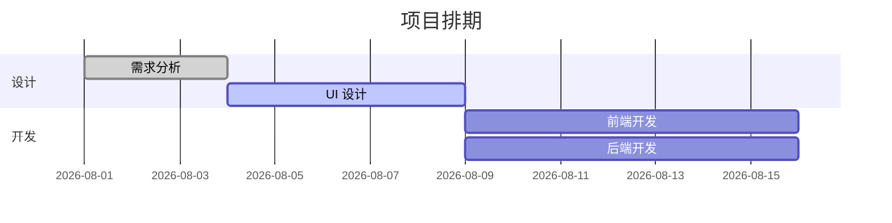

## 7. 饼图（pie）

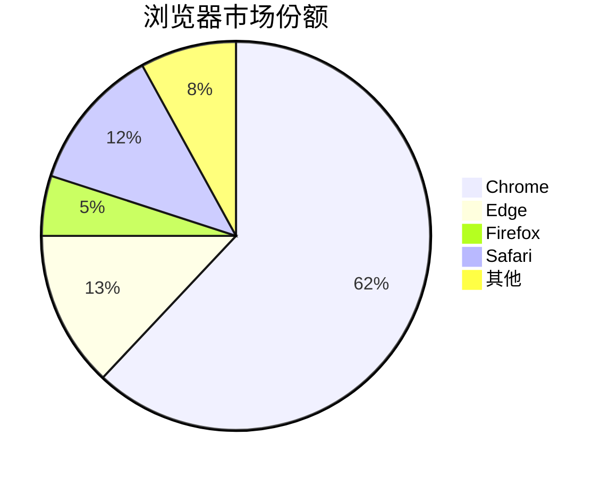

## 8. 旅行图（journey）

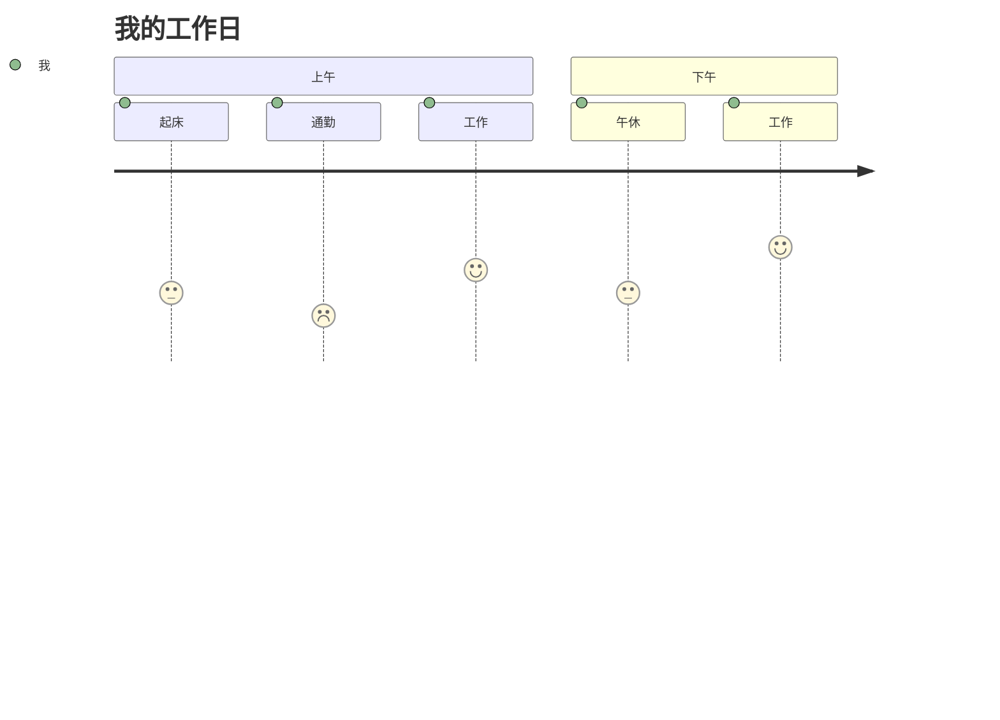

## 9. 思维导图（mindmap）

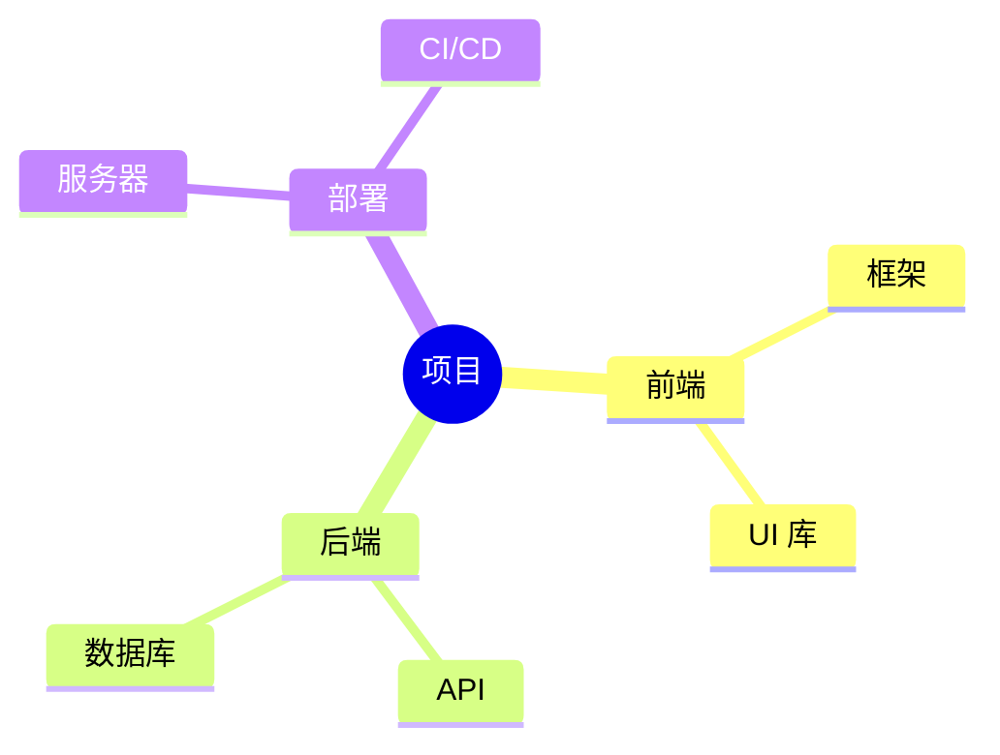

## 10. 时间线（timeline）

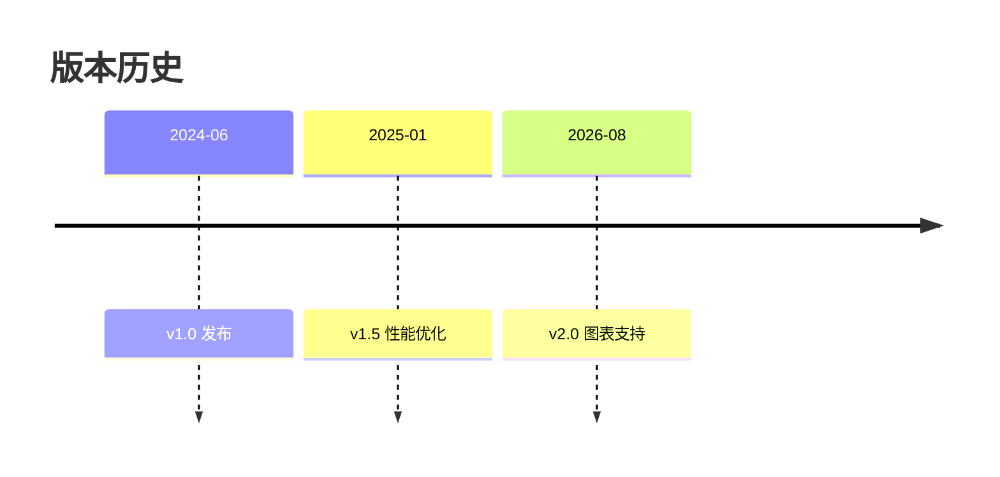

## 11. 象限图（quadrantChart）

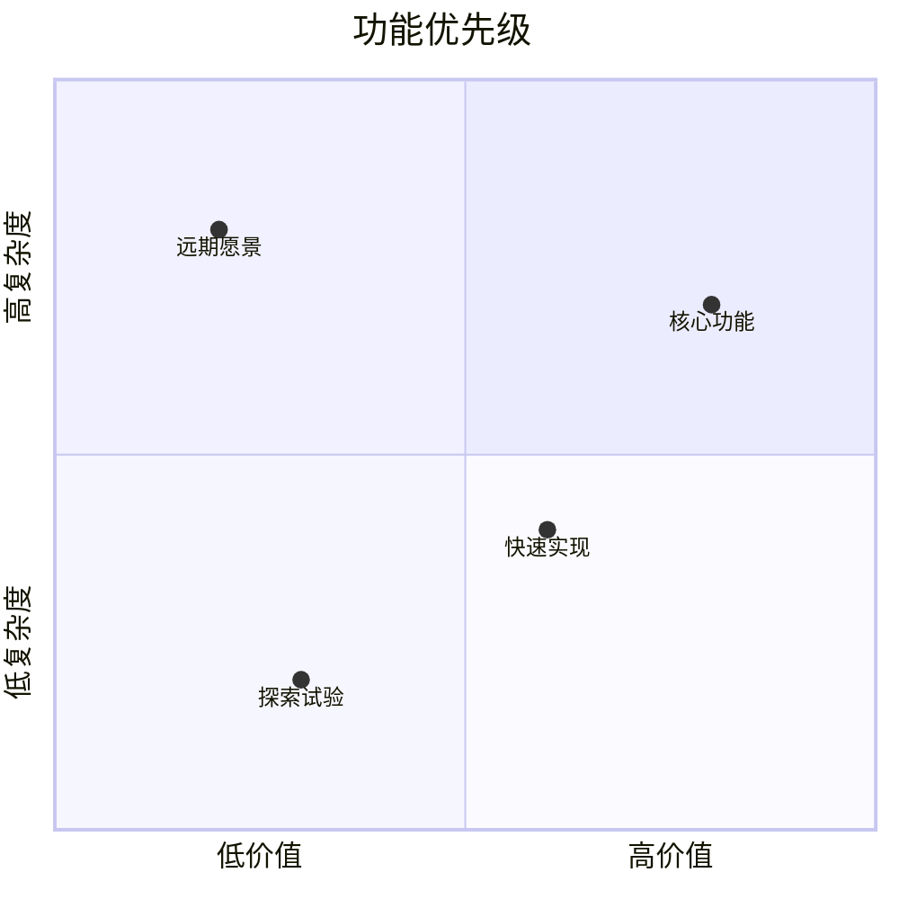

## 12. 需求图（requirementDiagram）

```mermaid
requirementDiagram
    requirement 登录功能 {
        id: 1
        text: 用户能够登录系统
        risk: high
        verifymethod: test
    }
    element 登录模块 {
        type: system
    }
    登录功能 - satisfies -> 登录模块
```

---

## 普通 markdown 元素（对照用）

- 普通列表项 A
- 普通列表项 B

| 列 1 | 列 2 |
|------|------|
| a    | b    |

```dart
void main() {
  print('这应该走普通代码块渲染');
}
```
